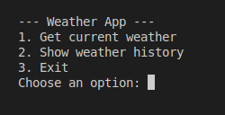
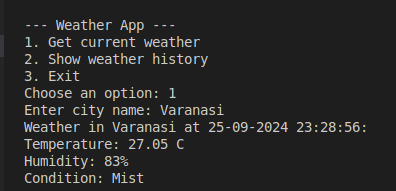
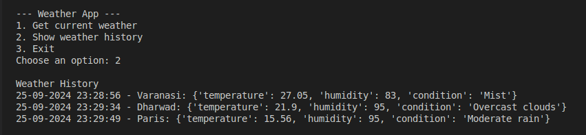
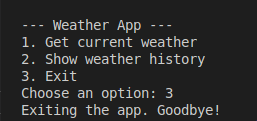

# Weather App ⛅️

Developed a weather application that fetches and displays real-time weather information for cities using the <strong>OpenWeatherMap</strong> API. The application allows user to check the current weather conditions, store weather history and retrieve it later. 

### Screenshots 🖼️
<table>
    <tr>
        <th>Menu</th>
        <th>Current Weather</th>
        <th>Weather History</th>
        <th>Exit</th>
    </tr>
    <tr>
        <td>
            
        </td>
        <td>
            
        </td>
        <td>
            
        </td>
        <td>
            
        </td>
    </tr>
</table>

## Key Features ✨
- **API Integration**: Integrated <strong>OpenWeatherMap</strong> API to fetch and display real-time weather data such as temperature, humidity and weather conditions.

- **Data Structures**: Used Python data structures like lists and dictionaries to store weather history and dynamically handle the application's data

- **Environment Variables**: Utilized environment variables to securely store the API key, ensuring data security and easy deployment across different environments.

- **Error Handling**: Implemented error handling to manage API errors and invalid city inputs.

## Technologies Used 🛠️
- **Language**: Python
- **API**: OpenWeatherMap API
- **Tools**: Requests library, ``python-dotenv`` for managing environment variables.
